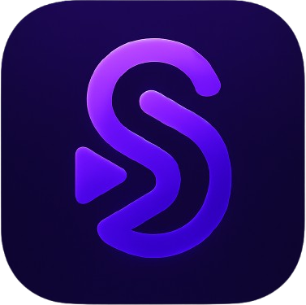
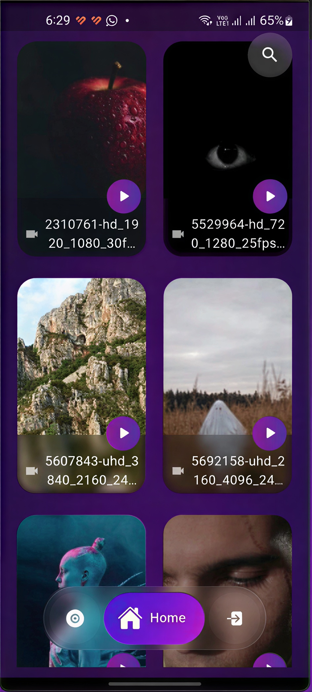

# Syncy

Real-time watch rooms for local video files, available on Android and Windows.

<p align="center">
  
</p>

<p align="center">
  <a href="https://syncy.kcraft.dev"></a>
  <a href="https://github.com/khaled-muhammad/Syncy/releases/latest"></a>
  
  
</p>

<p align="center">
  <a href="https://github.com/khaled-muhammad/Syncy/releases/latest/download/app-universal.apk"><strong>Download Android</strong></a>
  &nbsp;&middot;&nbsp;
  <a href="https://github.com/khaled-muhammad/Syncy/releases/latest/download/syncy-windows-release.zip"><strong>Download Windows</strong></a>
  &nbsp;&middot;&nbsp;
  <a href="https://github.com/khaled-muhammad/Syncy/releases/latest">Release notes</a>
</p>



## What Syncy does

Syncy keeps video playback aligned for everyone in a room while each device
plays the source locally or streams it from a paired PC. The backend owns a
revisioned playback state, so reconnects and late messages converge on the
newest play, pause, or seek command.

### Playback and rooms

- Millisecond-precise play, pause, and seek synchronization
- Revision-aware conflict handling and automatic reconnect recovery
- Android lifecycle reconciliation for status shade, app switching, and split screen
- Friends and Couple room modes
- Participant presence and durable room membership
- Shareable HTTPS room links that hand off to `syncy://`, plus readable join codes
- Recent rooms with one-tap rejoin on Android and Windows
- Host moderation with room locking, participant removal, and seek permissions
- Fullscreen playback, desktop keyboard controls, and double-tap seeking
- Playback rates from 0.25x to 10x

### Media and devices

- Automatic Android media discovery with thumbnails and search
- User-selected Windows library folders with nested folder browsing
- Desktop playback through `media_kit` for broad container and codec support
- Secure six-digit PC pairing over the local network
- Browse a paired Windows library from Android
- Direct LAN streaming with HTTP byte ranges for seeking
- Automatic matching SRT/VTT discovery with per-device language and timing offset
- Continue-watching shelves that resume unfinished videos at the saved position

### Updates

- Android sideloads and portable Windows builds check GitHub Releases for updates
- Update prompts link directly to the signed universal APK or Windows ZIP

### Social

- Live room chat with reconnect-safe recent history
- Typing indicators and online presence
- Floating reactions over the player

## Architecture

```text
Android / Windows Flutter app
        |
        | HTTPS + WebSocket
        v
Django + Channels + Daphne
        |
        +-- PostgreSQL: rooms, users, playback revisions, chat
        +-- Redis: realtime channel layer

Windows LAN host
        |
        +-- discovery + pairing + HTTP range streaming
        |
        v
Android LAN client
```

The Flutter player is abstracted behind `SyncPlayer`: Android uses
`video_player`, while Windows uses `media_kit`. `RoomController` routes local
and remote actions through an ordered playback synchronizer.

## Run locally

Requirements:

- Flutter `3.41.9`
- Dart `3.8+`
- Android SDK 21+ for Android builds
- Visual Studio with Desktop development with C++ for Windows builds
- Python 3.10+, PostgreSQL, and Redis for the backend

```bash
git clone https://github.com/khaled-muhammad/Syncy.git
cd Syncy
flutter pub get
flutter test
flutter run
```

Run the backend:

```bash
cd syncplay_backend
python -m venv venv
# Windows: venv\Scripts\activate
# Linux/macOS: source venv/bin/activate
pip install -r requirements.txt
python manage.py migrate
python manage.py runserver
```

Set `USE_SQLITE=true` for a lightweight local database. Production settings
are documented in [`syncplay_backend/DEPLOYMENT.md`](syncplay_backend/DEPLOYMENT.md).

## Build

```bash
flutter build windows --release
```

Android release builds require the permanent release keystore environment
variables described in [`docs/android-signing.md`](docs/android-signing.md).
Debug builds continue to work without signing secrets.

GitHub Actions builds Android and Windows on every push to `main`. Tags matching
`v*` publish a GitHub release with a universal APK, ABI-specific APKs, and a
portable Windows ZIP. The website and README download URLs always resolve
through GitHub's latest release. Release APKs are rejected before upload unless
they match the repository's pinned signing-certificate fingerprint.

## Project layout

```text
lib/
  controllers/          Room, library, profile, and LAN state
  services/player/      Shared player API and synchronization coordinator
  services/lan/         Discovery, pairing, library API, and range streaming
  screens/              Android and desktop interfaces
  widgets/              Player controls, chat, and reactions
syncplay_backend/       Django REST and Channels backend
landing_website/        React/Vite product site
```

## Contributing

```bash
git checkout -b feature/short-name
git commit -m "Describe the change"
git push origin feature/short-name
```

Open an issue for bugs or a pull request for focused improvements:
[issues](https://github.com/khaled-muhammad/Syncy/issues) ·
[discussions](https://github.com/khaled-muhammad/Syncy/discussions).

Built by Khaled Muhammad.
